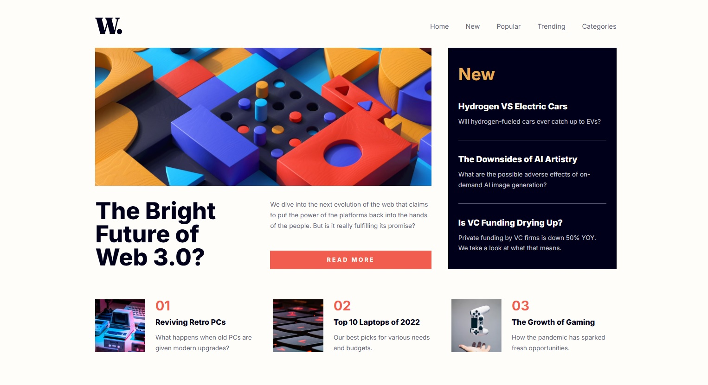

# News Homepage - Frontend Mentor Challenge



Una landing page moderna y responsive para un sitio de noticias, desarrollada con React y CSS puro siguiendo la metodología Atomic Design.

## 📋 Tabla de Contenidos

- [Descripción](#descripción)
- [Características](#características)
- [Tecnologías](#tecnologías)
- [Instalación](#instalación)
- [Estructura del Proyecto](#estructura-del-proyecto)
- [Arquitectura](#arquitectura)
- [Accesibilidad](#accesibilidad)
- [Scripts Disponibles](#scripts-disponibles)
- [Autor](#autor)

## 📖 Descripción

Este proyecto es una solución al [News homepage challenge de Frontend Mentor](https://www.frontendmentor.io/challenges/news-homepage-H6SWTa1MFl). El desafío consiste en construir una landing page de noticias que sea completamente responsive y accesible.

### El Desafío

Los usuarios deben poder:

- ✅ Ver el layout óptimo según el tamaño de su dispositivo (mobile, tablet, desktop)
- ✅ Interactuar con estados hover y focus en todos los elementos interactivos
- ✅ Abrir y cerrar el menú de navegación móvil
- ✅ Navegar usando solo el teclado (accesibilidad)
- ✅ Experiencia optimizada para lectores de pantalla

## ✨ Características

### Diseño y UX
- 📱 **Enfoque Mobile-First** - Diseño optimizado primero para móviles
- 🎨 **Totalmente Responsive** - Adaptable a todos los tamaños de pantalla
- 🎯 **CSS Grid Layout** - Maquetación moderna y flexible
- 🌈 **Transiciones Suaves** - Animaciones fluidas y profesionales
- 🎭 **Estados Interactivos** - Estados hover, focus y active en todos los elementos

### Accesibilidad (A11y)
- ♿ **Compatible WCAG 2.1 AA** - Cumple estándares de accesibilidad
- ⌨️ **Navegación por Teclado** - Navegación completa por teclado
- 🔊 **Amigable con Lectores de Pantalla** - Etiquetas ARIA y HTML semántico
- 👁️ **Focus Visible** - Indicadores visuales claros
- 🎬 **Movimiento Reducido** - Respeta preferencias de animación del usuario

### Código
- 🏗️ **Atomic Design** - Arquitectura escalable y mantenible
- 🔍 **Validación PropTypes** - Validación de props en todos los componentes
- 📦 **CSS Modular** - Estilos organizados por componente
- 🎯 **Separación de Responsabilidades** - Datos separados de la lógica
- 🧹 **Código Limpio** - Código limpio y bien documentado

## 🛠️ Tecnologías

### Núcleo
- **React 19.1.1** - Biblioteca de UI
- **Vite 7.1.7** - Herramienta de construcción y servidor de desarrollo
- **JavaScript (ES6+)** - Lenguaje de programación

### Estilos
- **CSS3** - Estilos puros sin preprocesadores
- **Variables CSS** - Variables CSS para tematización
- **CSS Grid y Flexbox** - Layouts modernos
- **Media Queries Mobile-First** - Diseño responsive

### Herramientas
- **ESLint** - Análisis de código
- **PropTypes** - Validación de tipos en tiempo de ejecución
- **Google Fonts (Inter)** - Tipografía

## 🚀 Instalación

### Prerrequisitos
- Node.js (v18 o superior)
- npm o yarn

### Pasos

1. **Clonar el repositorio**
```bash
git clone https://github.com/Oliver-92/news-homepage.git
cd news-homepage
```

2. **Instalar dependencias**
```bash
npm install
```

3. **Iniciar servidor de desarrollo**
```bash
npm run dev
```

4. **Abrir en el navegador**
```
http://localhost:5173
```

## 📁 Estructura del Proyecto

```
news-homepage/
├── src/
│   ├── components/
│   │   ├── atoms/              # Componentes básicos
│   │   │   ├── Button.jsx
│   │   │   ├── Logo.jsx
│   │   │   ├── MenuButton.jsx
│   │   │   └── NavLink.jsx
│   │   ├── molecules/          # Combinación de atoms
│   │   │   ├── ArticleCard.jsx
│   │   │   ├── Navigation.jsx
│   │   │   └── NewsCard.jsx
│   │   ├── organisms/          # Secciones complejas
│   │   │   ├── ArticleGrid.jsx
│   │   │   ├── Header.jsx
│   │   │   ├── Hero.jsx
│   │   │   └── NewsSidebar.jsx
│   │   ├── templates/          # Plantillas de página
│   │   │   └── MainTemplate.jsx
│   │   └── pages/              # Páginas completas
│   │       └── HomePage.jsx
│   ├── data/                   # Datos de la aplicación
│   │   ├── articlesData.js
│   │   └── newsData.js
│   ├── assets/
│   │   └── images/             # Imágenes del proyecto
│   ├── index.css               # Estilos globales y variables
│   ├── App.jsx                 # Componente raíz
│   └── main.jsx                # Entry point
├── design/                     # Diseños de referencia
├── public/
├── index.html
├── package.json
└── vite.config.js
```

## 🏛️ Arquitectura

### Atomic Design

El proyecto sigue la metodología **Atomic Design** de Brad Frost:

1. **Átomos** - Componentes más pequeños e indivisibles (Button, Logo, NavLink)
2. **Moléculas** - Grupos de átomos que funcionan juntos (Navigation, NewsCard)
3. **Organismos** - Componentes complejos formados por moléculas (Header, Hero)
4. **Plantillas** - Estructura de página sin contenido específico
5. **Páginas** - Instancias de plantillas con contenido real

### Principios Aplicados

- **Responsabilidad Única** - Cada componente tiene una única responsabilidad
- **No te Repitas (DRY)** - Datos centralizados, componentes reutilizables
- **Separación de Responsabilidades** - Lógica, estilos y datos separados
- **Mobile-First** - Estilos base para móvil, media queries para escritorio

## ♿ Accesibilidad

### Características Implementadas

- ✅ **HTML Semántico** - Uso correcto de etiquetas semánticas
- ✅ **Etiquetas ARIA** - Etiquetas descriptivas para lectores de pantalla
- ✅ **Navegación por Teclado** - Tab, Enter, Escape funcionan correctamente
- ✅ **Gestión de Focus** - Focus visible y lógico
- ✅ **Texto Alternativo** - Todas las imágenes tienen texto alternativo
- ✅ **Contraste de Color** - Ratios de contraste WCAG AA
- ✅ **Movimiento Reducido** - Respeta `prefers-reduced-motion`

### Pruebas de Accesibilidad

```bash
# Recomendado: usar herramientas como
- Lighthouse (Chrome DevTools)
- axe DevTools
- WAVE Extension
```

## 📜 Scripts Disponibles

```bash
# Desarrollo
npm run dev          # Inicia servidor de desarrollo

# Producción
npm run build        # Crea build optimizado
npm run preview      # Preview del build de producción

# Calidad de código
npm run lint         # Ejecuta ESLint
```

## 🎨 Variables CSS Globales

El proyecto utiliza CSS Custom Properties para facilitar la tematización:

```css
/* Colores */
--color-soft-orange: hsl(35, 77%, 62%)
--color-soft-red: hsl(5, 85%, 63%)
--color-off-white: hsl(36, 100%, 99%)
--color-very-dark-blue: hsl(240, 100%, 5%)

/* Tipografía */
--font-family: 'Inter', sans-serif
--font-weight-regular: 400
--font-weight-bold: 700
--font-weight-extra-bold: 800

/* Breakpoints */
--breakpoint-mobile: 375px
--breakpoint-tablet: 768px
--breakpoint-desktop: 1440px
```

## 📱 Puntos de Quiebre Responsive

- **Móvil**: 375px - 767px
- **Tablet**: 768px - 1023px
- **Escritorio**: 1024px+

## 🎯 Mejores Prácticas Implementadas

- ✅ PropTypes para validación de componentes
- ✅ Componentes funcionales con hooks
- ✅ CSS modular por componente
- ✅ Nombres descriptivos (estilo BEM)
- ✅ Código limpio
- ✅ Sin dependencias innecesarias
- ✅ Optimización de imágenes

## 👨‍💻 Autor

- **Frontend Mentor** - [@Oliver-92](https://www.frontendmentor.io/profile/Oliver-92)
- **GitHub** - [@Oliver-92](https://github.com/Oliver-92)
- **Portfolio** - [Ezequiel Oliver](https://oliver-92.github.io/Portafolio/)

## 📄 Licencia

Este proyecto es de código abierto y está disponible bajo la licencia MIT.

---

**Desarrollado con ❤️ siguiendo las mejores prácticas de desarrollo web moderno**
